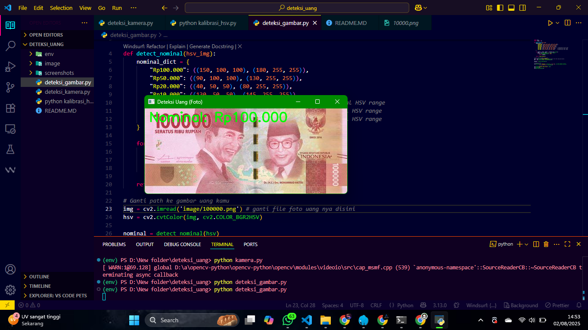

# 💵 Deteksi Uang Menggunakan OpenCV

Proyek ini merupakan implementasi sederhana deteksi objek uang kertas menggunakan **OpenCV** dan **Python**. Sistem dapat mengenali uang dari **kamera langsung** maupun **gambar statis** berdasarkan ciri visual.

## 🛠️ Fitur

- Deteksi uang dari kamera (live webcam)
- Deteksi uang dari gambar/foto
- Visualisasi hasil deteksi dengan bounding box dan label nilai uang
- Sistem threshold HSV dan kontur sederhana

## 🖼️ Contoh Output

### 📷 Deteksi dari Kamera


### 🖼️ Deteksi dari Gambar


## 🧰 Dependencies

Pastikan kamu sudah meng-install dependency berikut:

```bash
pip install opencv-python numpy
```
📁 Struktur Folder
```bash
.
├── deteksi_kamera.py
├── deteksi_gambar.py
├── uang/
│   ├── 1000.jpg
│   ├── 2000.jpg
│   ├── 5000.jpg
│   ├── 10000.jpg
│   ├── 20000.jpg
│   ├── 50000.jpg
│   └── 100000.jpg
├── screenshots/
│   ├── deteksi_kamera.png
│   └── deteksi_gambar.png
└── README.md
```

🚀 Cara Menjalankan
📷 Deteksi dari Kamera
```bash
python deteksi_kamera.py
```
🖼️ Deteksi dari Gambar
```bash
python deteksi_gambar.py
```
Ganti path gambar jika ingin menguji gambar selain default.

💡 Catatan
Sistem ini menggunakan pendekatan dasar dengan HSV dan thresholding untuk mendeteksi warna khas tiap uang.

Akurasi tergantung pada pencahayaan, posisi uang, dan kondisi kamera.

Cocok sebagai studi kasus Computer Vision dasar untuk pemula.

## 📄 Lisensi

Proyek ini dilisensikan di bawah [MIT License](LICENSE) © 2025 Libra ID.


---


